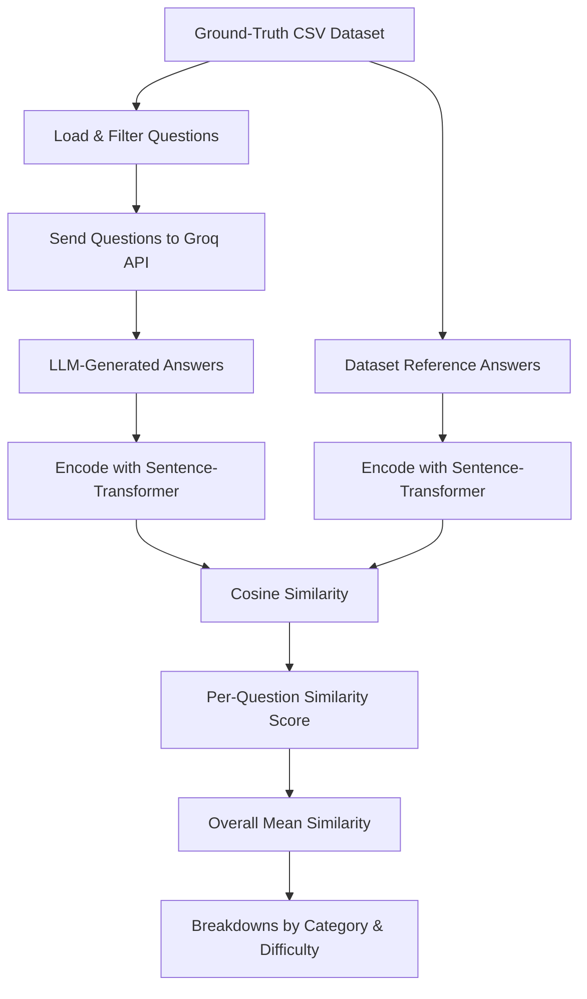

# Similarity Module — Full Documentation

## Overview

The **Similarity** module measures how semantically close LLM-generated answers are to expert ground-truth answers. It uses **sentence-transformer embeddings** and **cosine similarity** to produce a score between 0 and 1, where higher = more similar in meaning.

> [!IMPORTANT]
> The module is **fully self-contained** — it calls the Groq API directly for answer generation and uses a local embedding model for scoring. No dependency on other running services.

---

## Architecture



---

## Ground-Truth Dataset

### Source & Structure

- **File**: [ground_truth.csv](file:///e:/HireVision/Module-3/Metrics/Similarity/data/ground_truth.csv)
- **Size**: 201 expert-curated Q&A pairs
- **7 columns**: `Question Number`, `Question`, `Answer`, `Category`, `Difficulty`, `Skill`, `Job Role`

### Dataset Composition

| Category | Count | Examples |
|----------|-------|---------|
| General Programming | 10 | OOP, Design Patterns, SOLID |
| Data Structures | 10 | Arrays, Hash Tables, Dynamic Programming |
| Languages and Frameworks | 10 | JavaScript, Python, Java |
| Database and SQL | 10 | Indexing, Normalization, Joins |
| Web Development | 10 | DOM, HTTP/S, CORS, SEO |
| Software Testing | 10 | Unit Testing, CI/CD, Code Coverage |
| Version Control | 10 | Git, Branching, Merge Conflicts |
| System Design | 10+ | Microservices, Load Balancing, CAP Theorem |
| Security | 10 | SQL Injection, XSS, OAuth |
| DevOps | 10+ | Docker, Kubernetes, IaC |
| Front-end | ~15 | React hooks, Closures, Lazy Loading |
| Back-end | ~15 | Race Conditions, REST APIs, NoSQL |
| Full-stack | ~8 | MVC, Memoization, Binary Search |
| Advanced (Algorithms, ML, etc.) | ~50 | PageRank, Deep Learning, Compilers |

| Difficulty | Distribution |
|------------|-------------|
| **Easy** | ~5% of questions |
| **Medium** | ~60% of questions |
| **Hard** | ~35% of questions |

| Job Role | Examples |
|----------|---------|
| Software Engineer | Programming, Data Structures, Algorithms |
| Database Administrator | SQL, Normalization, Query Optimization |
| Full-stack Developer | Web Dev, MVC, APIs |
| QA Engineer | Testing, CI/CD, Automation |
| DevOps Engineer | Docker, Kubernetes, Monitoring |
| System Architect | Distributed Systems, Scalability |
| Cybersecurity Engineer | Security attacks, Authentication |
| + specialists | ML Engineer, Network Engineer, Data Engineer, etc. |

### Data Preprocessing

When loading the dataset, the following preprocessing steps are applied in [similarity_scorer.py](file:///e:/HireVision/Module-3/Metrics/Similarity/similarity_scorer.py):

1. **CSV reading** — loaded via `csv.DictReader` with UTF-8 encoding
2. **Key normalization** — all column headers are stripped of whitespace and lowercased (`k.strip().lower()`)
3. **Value trimming** — all cell values are stripped of leading/trailing whitespace (`v.strip()`)
4. **Optional filtering** — case-insensitive partial match on `category`, `difficulty`, or `skill`
   - Example: `category="dev"` matches both "DevOps" and "Web Development"
5. **Question limiting** — the `/pipeline` endpoint supports `num_questions` to cap how many dataset rows to evaluate


### Data Corrections Done

- **"General Program" → "General Programming"** — fixed a typo in the Category column to ensure consistent grouping and accurate breakdown analysis

### How the Job Role Column Was Generated

The `Job Role` column was **not part of the original dataset**. It was added later to enable per-role similarity analysis. Each question was assigned a job role based on a **deterministic 1-to-1 mapping from its Category**:

| Category | → Job Role |
|----------|-----------|
| General Programming | Software Engineer |
| Data Structures | Software Engineer |
| Languages and Frameworks | Software Engineer |
| Version Control | Software Engineer |
| Algorithms | Software Engineer |
| Database and SQL | Database Administrator |
| Database Systems | Database Engineer |
| Web Development | Full-stack Developer |
| Full-stack | Full-stack Developer |
| Front-end | Frontend Developer |
| Back-end | Backend Developer |
| Software Testing | QA Engineer |
| DevOps | DevOps Engineer |
| System Design | System Architect |
| Security | Cybersecurity Engineer |
| Machine Learning | Machine Learning Engineer |
| Artificial Intelligence | AI Engineer |
| Networking | Network Engineer |
| Data Engineering | Data Engineer |
| Distributed Systems | Distributed Systems Engineer |
| Low-level Systems | Systems Programmer |

**How it was done**: The mapping was applied programmatically — each row's [Category](file:///e:/HireVision/Module-3/Metrics/Similarity/models.py#83-88) value was looked up in the mapping table above, and the corresponding `Job Role` was written into the new column. This ensures every question is tagged with the most appropriate professional role, enabling the similarity metric to be analyzed per job role (e.g., "How well does the LLM answer Database Administrator questions vs. DevOps Engineer questions?").

---

## Key Components

### 1. Answer Generator — [answer_generator.py](file:///e:/HireVision/Module-3/Metrics/Similarity/answer_generator.py)

Generates LLM answers for dataset questions using the **same model, prompt, and schema** as the Question-Generation module.

| Setting | Value |
|---------|-------|
| API | Groq |
| Model | `ACTIVE_MODEL` from `.env` (default: `openai/gpt-oss-120b`) |
| Temperature | `0.1` (near-deterministic) |
| Response format | JSON with `{answers: [{question_id, question_type, reference_answer}]}` |

**Flow**: Questions → formatted as numbered list → sent to Groq → JSON parsed → mapped back to original questions.

### 2. Similarity Scorer — [similarity_scorer.py](file:///e:/HireVision/Module-3/Metrics/Similarity/similarity_scorer.py)

| Setting | Value |
|---------|-------|
| Embedding model | `mixedbread-ai/mxbai-embed-large-v1` |
| Normalization | `normalize_embeddings=True` |
| Metric | Cosine similarity |
| Score range | `[0, 1]` (1 = identical meaning) |

**Core functions**:
- [compute_similarity(generated, reference)](file:///e:/HireVision/Module-3/Metrics/Similarity/similarity_scorer.py#77-90) — single pair → float
- [compute_batch_similarity(pairs)](file:///e:/HireVision/Module-3/Metrics/Similarity/similarity_scorer.py#92-131) — batch of pairs → list of floats + mean
- [find_most_similar(text, references, top_k)](file:///e:/HireVision/Module-3/Metrics/Similarity/similarity_scorer.py#133-169) — find closest matches in dataset

### 3. Router (API) — [router.py](file:///e:/HireVision/Module-3/Metrics/Similarity/router.py)

Three endpoints orchestrating different use cases (see API Endpoints below).

---

## How Similarity Is Computed

### Per-Question Similarity

1. **Encode** the generated answer into a vector using `mxbai-embed-large-v1`
2. **Encode** the ground-truth answer using the same model
3. Both embeddings are **pre-normalized** (unit vectors)
4. **Cosine similarity** = dot product of the two normalized vectors

```
similarity = cos(θ) = A · B    (since ‖A‖ = ‖B‖ = 1)
```

### Overall Similarity

```
mean_similarity = Σ(similarity_i) / N
```

Simple arithmetic mean of all per-question cosine similarity scores.

### Breakdowns

Results are also grouped by **category** and **difficulty**, computing `mean_similarity` within each group.

---

## API Endpoints

| Endpoint | Purpose | Needs LLM? |
|----------|---------|-------------|
| `POST /text` | Compare arbitrary [(generated, reference)](file:///e:/HireVision/Module-3/Metrics/Similarity/models.py#11-15) text pairs | No |
| `POST /dataset` | Compare user-provided answers against closest ground-truth match | No |
| `POST /pipeline` | Full flow: load dataset → generate LLM answers → compare | Yes (Groq) |

### `POST /pipeline` — Full Self-Contained Evaluation

The main endpoint. Steps:

| Step | Action |
|------|--------|
| 1 | Load questions from [ground_truth.csv](file:///e:/HireVision/Module-3/Metrics/Similarity/data/ground_truth.csv) (with optional filters) |
| 2 | Send questions to **Groq API** → get LLM answers |
| 3 | Compute cosine similarity: LLM answer vs. dataset answer (per question) |
| 4 | Aggregate into `mean_similarity` + breakdowns by category/difficulty |

---

## Work Done with This Metric

### Analysis Notebooks

Two Jupyter notebooks were created for dataset analysis and evaluation:

1. **[dataset_analysis.ipynb](file:///e:/HireVision/Module-3/Metrics/Similarity/data/dataset_analysis.ipynb)** — Exploratory analysis of the ground-truth dataset:
   - Distribution of questions by **Category**, **Difficulty**, and **Skill**
   - Distribution of questions by **Job Role** (added later)
   - Verified data quality and identified the "General Program" typo

2. **[similarity_by_job_role.ipynb](file:///e:/HireVision/Module-3/Metrics/Similarity/data/similarity_by_job_role.ipynb)** — Similarity evaluation broken down by job role:
   - Runs the pipeline for different job roles
   - Compares LLM-generated answers against expert answers
   - Visualizes similarity scores across roles

### Key Development Work

| Task | Description |
|------|-------------|
| **Self-contained answer generation** | Originally depended on external Question-Generation service. Refactored to call Groq API directly, making the module fully independent |
| **Embedding model selection** | Switched to `mixedbread-ai/mxbai-embed-large-v1` for higher quality embeddings |
| **Same-question comparison** | Ensured the pipeline compares the LLM's answer to the **same question's** ground-truth answer (not closest match across all answers) |
| **Job Role column** | Added `Job Role` column to [ground_truth.csv](file:///e:/HireVision/Module-3/Metrics/Similarity/data/ground_truth.csv) for per-role analysis |
| **Category typo fix** | Corrected "General Program" → "General Programming" |
| **Schema removal** | Removed schema-related dependencies from answer generation to streamline the pipeline |

---

## Response Structure (Pipeline Example)

```json
{
  "results": [
    {
      "question": "What is polymorphism?",
      "dataset_answer": "Polymorphism allows objects...",
      "generated_answer": "Polymorphism is when...",
      "similarity": 0.8734,
      "category": "OOP",
      "difficulty": "Easy",
      "skill": "Python"
    }
  ],
  "mean_similarity": 0.8521,
  "by_category": [
    {"label": "OOP", "count": 5, "mean_similarity": 0.8612}
  ],
  "by_difficulty": [
    {"label": "Easy", "count": 3, "mean_similarity": 0.8901}
  ],
  "dataset_size": 201,
  "model_name": "mixedbread-ai/mxbai-embed-large-v1",
  "num_questions_evaluated": 10
}
```

---

## Summary Table

| Aspect | Detail |
|--------|--------|
| **What it measures** | Semantic closeness of LLM answers to expert answers |
| **Embedding model** | `mixedbread-ai/mxbai-embed-large-v1` |
| **Scoring method** | Cosine similarity on normalized embeddings |
| **Score range** | 0.0 (unrelated) to 1.0 (identical meaning) |
| **Overall score** | Simple mean of all per-question similarities |
| **LLM for generation** | Groq API (`ACTIVE_MODEL` from `.env`) |
| **Dataset** | 201 expert Q&A pairs across 14+ categories |
| **Breakdowns** | By `category` and `difficulty` |
| **Preprocessing** | Key normalization, value trimming, case-insensitive filtering |
